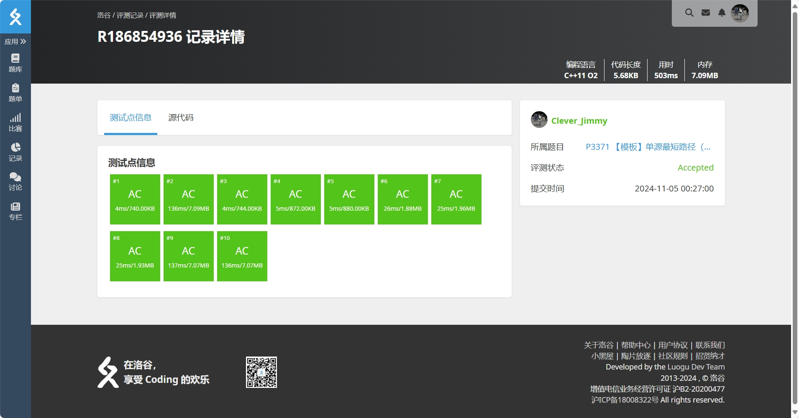

# MySTL

MySTL 是一个简单的 C++ STL 实现，目前实现了 `vector`、`list`、`deque`、`stack`、`queue` 等容器。
编译并运行 `test.cpp` 可以测试这些容器的功能。期望输出如下：

```bash
All tests passed for deque!
All tests passed for list!
All tests passed for queue!
All tests passed for stack!
All tests passed for vector!
```

## Vector

### 实现

`vector` 是一个动态数组，它的内部实现是一个连续的内存空间，当元素个数超过当前内存空间时，会重新分配一块更大的内存空间（具体而言，是原来空间的 2 倍），并将原有元素拷贝到新的内存空间中。

### 测试

`tests/vector_test.cpp` 中包含了对 `vector` 的测试用例，测试了 `vector` 的构造、拷贝构造、赋值、迭代器、插入、删除等操作。

## List

### 实现

`list` 是一个双向链表，它的内部实现是一个双向链表，每个节点包含一个指向前一个节点的指针和一个指向后一个节点的指针。

### 测试

`tests/list_test.cpp` 中包含了对 `list` 的测试用例，测试了 `list` 的构造、拷贝构造、赋值等操作。

## Deque

### 实现

`deque` 是一个双端队列，它的内部实现是一个链表数组，每个链表节点包含一个指向前一个节点的指针和一个指向后一个节点的指针。
这样可以在头尾两端进行高效的插入和删除操作。

### 测试

`tests/deque_test.cpp` 中包含了对 `deque` 的测试用例，测试了 `deque` 的构造、拷贝构造、赋值、在队首和队尾插入和删除等操作。

## Stack

### 实现

`stack` 是一个后进先出的容器，它的内部实现是一个 `deque`，但是只提供了栈的操作接口。

### 测试

`tests/stack_test.cpp` 中包含了对 `stack` 的测试用例，测试了 `stack` 的构造、拷贝构造、赋值、入栈、出栈等操作。

## Queue

### 实现

`queue` 是一个先进先出的容器，它的内部实现是一个 `deque`，但是只提供了队列的操作接口。

### 测试

`tests/queue_test.cpp` 中包含了对 `queue` 的测试用例，测试了 `queue` 的构造、拷贝构造、赋值、入队、出队等操作。

## 实际应用

SPFA 算法是一种求解单源最短路径的算法，它的基本思想是利用队列进行松弛操作，直到队列为空。`example.cpp` 中展示了如何使用 `MySTL` 中的 `queue` 实现 SPFA 算法。它在 [洛谷 | P3371 【模板】单源最短路径（弱化版）](https://www.luogu.com.cn/problem/P3371) 上的[评测结果](https://www.luogu.com.cn/record/186847287)为 100 分。


