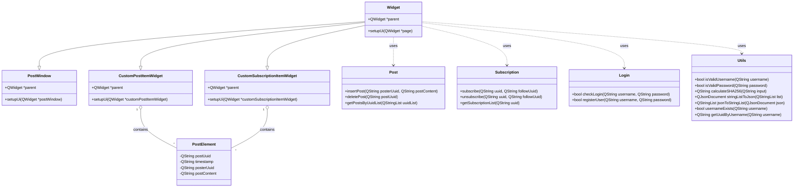
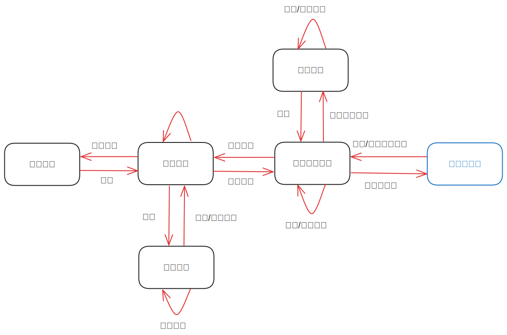

# 《计算机程序设计进阶》大作业选题报告

熊泽恩 2022011223

## 需求分析

我希望能够在本课程的大作业中：

- 实现一个类似 Twitter 的社交媒体应用
- 支持用户进行登录、注册、发布和删除内容
- 支持不同用户之间相互关注，关注对方后可看对方发布内容

我准备一个名为 *Shwitter* 的应用程序，满足以上要求，支持多用户同时在线，且能在本地利用数据库进行持久存储。

## 详细设计

### 数据库的表结构

#### 用户账号以及密码

对于每个用户而言，在注册时分配一个唯一标识符。表结构设计如下：唯一标识符、用户名、密码作为 `user` 表的三个字段，其中唯一标识符作为主键。

#### 关注列表

对于每个用户而言，都有一个关注列表。表结构设计如下：某用户的唯一标识符、该用户关注的所有用户的唯一标识符构成的列表作为 `subscription` 表的两个字段，其中该用户的唯一标识符作为主键。

#### 发布内容

对于每条动态而言，在发表时分配一个唯一标识符。该动态还应有表示发表时间的时间戳、发表者的唯一标识符、动态的内容。表结构设计如下：动态的唯一标识符、表示发表时间的时间戳、发表者的唯一标识符、动态的内容作为 `posts` 表的四个字段，其中动态的唯一标识符作为主键。

### 用户登录与注册相关逻辑

#### 登录

登录时在 `user` 表中查找是否有 `username` 和 `password` 均匹配的项。如果有，则登陆成功，将该用户的唯一标识符并存入 `global_user_uuid` 中，然后转入发表动态页面；否则，登录失败，弹出提示框，提示用户重新登录。

为了保证安全，即使是在数据库泄露的情况下也无法获得用户名对应的明文密码，本项目使用了 SHA256 的加密方式。数据库中仅存储密码经过 SHA256 后的值。在用户登录的时候也仅仅将用户输入的密码进行 SHA256 后再与数据库中的内容进行比对。

#### 注册

注册时：

- 首先检查注册的用户名以及密码是否合法，本程序要求
  - 用户名为长度为 1~20 的由字母、数字和下划线组成的字符串
  - 密码为长度 8~20 的由字母、数字和下划线组成的字符串
- 其次检查该用户名是否已被注册
- 最后检查两次输入的密码是否相同

如果上述检查均通过，则注册成功，在数据库中新增一项数据，并转入登录页面；否则注册失败，弹出提示框，提示用户重新注册。

#### 退出登录

将 `global_user_uuid` 清零并转入登录页面。

### 用户新增/删除关注相关逻辑

- 在点击“关注”按钮后，检查该用户名是否存在。如果存在，则弹出提示框，提示关注成功，并在数据库中添加此关注关系；否则关注失败，弹出提示框，提示用户重新关注。
- 在点击“取消关注”按钮后，弹出提示框，询问用户是否取消关注。如果是，则在数据库中删除此关注关系；否则不做任何操作。

此逻辑的重点在于**如何在数据库中添加/删除此关注关系**。

添加操作有三种情况：

- 如果以前此用户从未关注过其他用户，则数据库中不存在该项，只需要插入一项即可；
- 如果以前此用户关注过其他用户单位关注过此用户，则应从数据库中查询出原来的这项数据，在列表后追加此用户的唯一标识符，再更新至数据库中；
- 如果以前此用户已关注此用户，则跳过。

### 用户发表/删除动态相关逻辑

- 在用户发表一条新的动态后，在数据库中插入新的一项数据即可。
- 在用户点击某条动态的“删除”按钮后，弹出提示框，询问用户是否删除此动态。如果是，则在数据库中删除此项数据；否则不做任何操作。

### 展示关注列表相关逻辑

- 首先从数据库中获取当前用户的关注列表
- 然后在列表组件中填充数据

值得注意的是，每当当前用户执行关注/取消关注的操作后，都应重新更新并展示关注列表。

### 展示其他用户动态相关逻辑

- 首先从数据库中获取当前用户的关注列表
- 其次从数据库中获取该列表中所有用户的所有动态
- 最后在列表组件中填充这些数据

值得注意的是，每当当前用户执行发表/删除动态的操作后，都应重新更新并展示其他用户动态。

## 类图

我初步的想法如下：

## 流程图

用户使用 *Shwitter* 时的流程图如下图所示：

